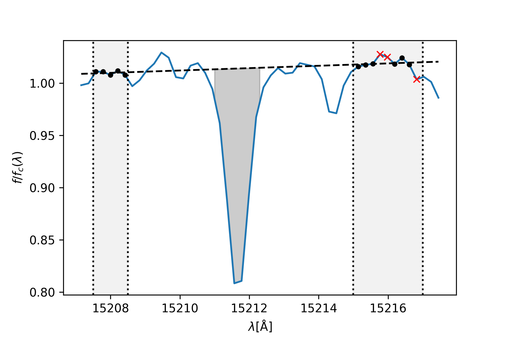

# sewingmachine
Tools for fast and easy spectra equivalent widths

## Overview

`sewingmachine` is a handy tool for measuring simple equivalent widths in spectra - originally designed for use with stellar spectra, it works on *any* 1 dimensional spectrum (Galaxy, planet, sound, space-faring tesla roadster), all you have to do is supply the line definitions, and away you go!

## Installation

At its most basic level, `sewingmachine` only needs the standard `scipy` stack to run. To use the embedded functionality for measurement of APOGEE spectra (and the tutorial sections on this page), you will need to install Jo Bovy's [`apogee`](https://github.com/jobovy/apogee.git) package (note that this install requires some additions to your login scripts!). 

The best way to install the package for now is to clone the repository and use `python setup.py install`. For a more basic install you can just use `pip install sewingmachine` - but while `sewingmachine` is still in active development, this is not reccomended! 

## Basic Usage

`sewingmachine` is intended to be as flexible as possible, whilst delivering maximal stability and standardisation in equivalent width measurements. In future versions, we hope to add to the different measurement methods available - for now, we can just do a simple trapezium integration of a spectrum.

For the simplest equivalent width measurement, first load your spectrum into a `[N_lambda,2]` array (`[N_lambda,3]` if you have an error array, but we'll get to that later), and pass it to `equivalentwidths.trapz_ew` like so:

    from sewingmachine import equivalentwidths
    equivalentwidths.trapz_ew(spectrum, integration, windows)
    
This will fit a line to the pixels in the regions specified in the list of tuples `windows`, and then integrate the pixels (and fractional pixels) between the tuple in `integration`. Bad pixels are automatically discounted in the continuum fit, and a 2-sigma clip is applied to the first fit, then the continuum is re-fitted. This behaviour can be changed using the keyword arguments `exclude_bad`, `sigmaclip`, and `sigma`. 

To better illustrate the action of these keywords, lets use the plotting functionality of the `trapz_ew` function, specifying `plot=True`. First, we load up an apogee spectrum and its error array (extensions 1 and 2), then funnel these, along with the wavelength array, into an [N,3] array:

    import apogee.tools.read as apread
    import apogee.spec.plot as splot
    lams= splot.apStarWavegrid()
    inds = (lams > 15206) & (lams < 15218)
    spec, hdr = apread.aspcapStar(4120, '2M00221738+6957505', ext=1)
    errspec, hdr = apread.aspcapStar(4120, '2M00221738+6957505', ext=2)
    spectrum = np.dstack([lams,spec,errspec])[0]

Then define your integration region and continuum windows, and run `trapz_ew` specifying that we need errors (`error=True`), we want a 1-sigma clip applied to the initial continuum fit (`sigmaclip=True` and `sigma=1.`), and all bad pixels in the continuum should be ignored. 

    integration = [15211, 15212.3]
    windows = [[15207.5,15208.5], [15215,15217]]

    equivalentwidths.trapz_ew(spectrum, integration, windows, 
                              plot=True, 
                              sigmaclip=True, 
                              sigma=1., 
                              exclude_bad=True, 
                              error=True)

The code will then output the equivalent width and its error as a tuple:

    >>> (0.15623079470219101, 0.019354601913129797)
    
and show you the diagnostic plot that we wanted:

This shows the measured line and the continuum regions, with pixels used in the final fit in black, and the clipped pixels as red crosses. Thankfully, there are no bad pixels in this line, but these would also have been ignored by the initial and final fit. The area integrated for the final EW is shown in grey.

    

